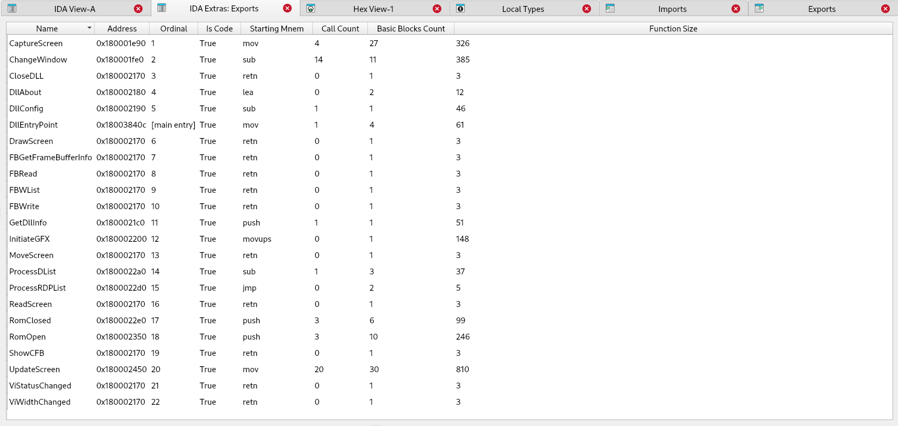
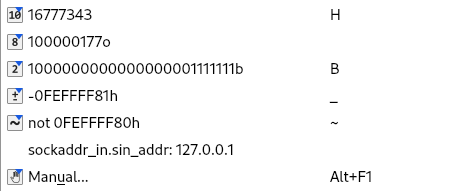
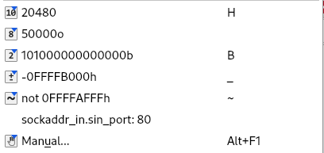

# IDA Extras

IDA extras is a (growing) collection of IDA UI and other enhancements to overcome some challenges when using IDA.

## Prerequisites

- IDA Pro: Version 8.4 or higher \*
- Python: 3.10+ \*

\*: The plugin has not been tested on lower versions of these dependencies and is not guaranteed to work. You may test it at your own risk.

## Installation

1. **Clone the repository**:

   ```bash
   git clone https://github.com/Still34/IDAExtras.git
   ```

2. **Copy plugin files**:
   - Copy `IDAExtras.py` and the `/idaextras` directory to your IDA plugins folder:
     - Windows: `%IDAUSR%/plugins` or `%IDADIR%/plugins`
     - macOS/Linux: `$IDAUSR/plugins` or `$IDADIR/plugins`

3. **Verify installation**:
   - Restart IDA Pro
   - Check that "IDA Extras" appears in the plugins menu

## Features

### Exports

`IDA Extras: Exports` renders another tab similar to the default Exports tab but will provide additional detail about the exports.  This interface came about due to wanting a quick way to find exports of interest when dealing with many exports where a number of them are just `retn` statements.

There is even an `AutoFilter` option to remove all of the ones with `retn` mnemonic or where the `Is Code` flag is `False`.



 <!-- todo: fix video --> 

### Copy Bytes

Adds a convenient **Copy Bytes** option to the right-click context menu in both disassembler and hex views.

Whilst there is already a built-in IDA feature named `ExportData` (`SHIFT+E`) that does a similar thing, this implementation makes it just a little faster without having to manually copy paste the output from the Qt window.

**Known Limitations**:
- **Disassembler view**: Copies entire instruction lines when selection spans partial lines
- **Hex viewer**: May occasionally include one extra byte when copying from the hex viewer
- **Hex viewer**: Selection boundaries based on mouse clicks, not highlighted region

### Network Structure Decoding

Right-click on `DWORD` or `WORD` values in the disassembly to decode network-related data structures.

**Supported Formats**:
- **sockaddr_in.sin_addr**: Converts 4-byte values to IP address format
- **sockaddr_in.sin_port**: Converts 2-byte values to port numbers

The decoded values are automatically added as comments for future reference.

**sockaddr_in.sin_addr representation**



**sockaddr_in.sin_port representation**



## License

This project is licensed under the MIT License - see the [LICENSE](LICENSE) file for details.

## History

This repository was originally developed by [@xorhex](https://github.com/xorhex) and transferred to [@Still34](https://github.com/Still34) on September 15, 2025, as the original maintainer has migrated to a different disassembler platform.

***

**Note**: If any functionality described here is already available in IDA Pro through built-in features, please [file an issue](https://github.com/Still34/IDAExtras/issues) so we can evaluate whether the enhancement is still needed.
